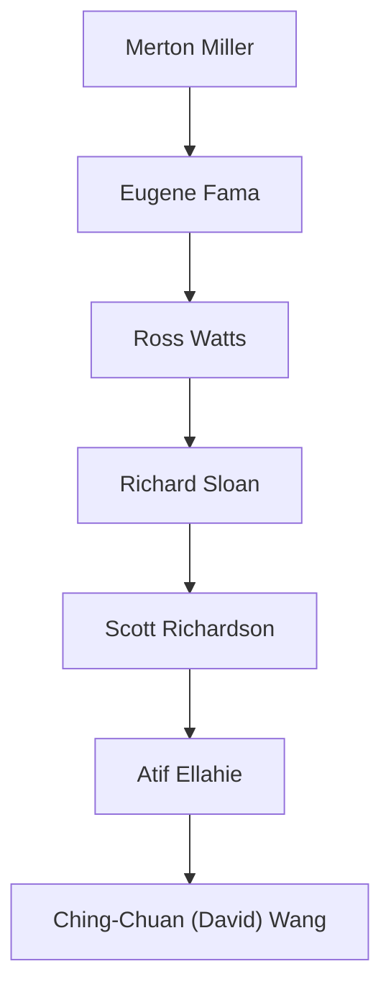

## Academic Genealogy

- Merton Miller  
  - Eugene Fama  
    - Ross Watts  
      - Richard Sloan  
        - Scott Richardson  
          - Atif Ellahie  
            - Ching-Chuan (David) Wang

Click to expand Mermaid version

  
Merton Miller ↓ 
  Eugene Fama ↓ 
  Ross Watts ↓ 
  Richard Sloan ↓ 
  Scott Richardson ↓ 
  Atif Ellahie ↓ 
  <strong>Ching-Chuan (David) Wang</strong>

graph TD
  Miller["Merton Miller"]
  Fama["Eugene Fama"]
  Watts["Ross Watts"]
  Sloan["Richard Sloan"]
  Richardson["Scott Richardson"]
  Ellahie["Atif Ellahie"]
  Wang["Ching-Chuan (David) Wang"]

  Miller --> Fama
  Fama --> Watts
  Watts --> Sloan
  Sloan --> Richardson
  Richardson --> Ellahie
  Ellahie --> Wang

